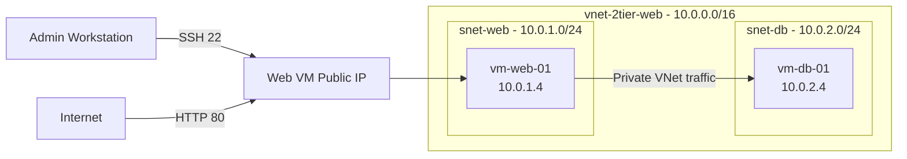
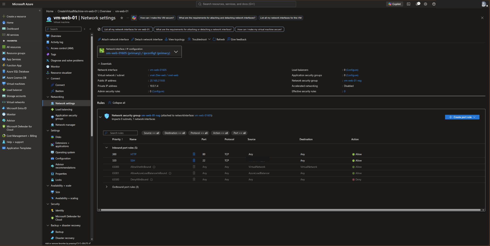
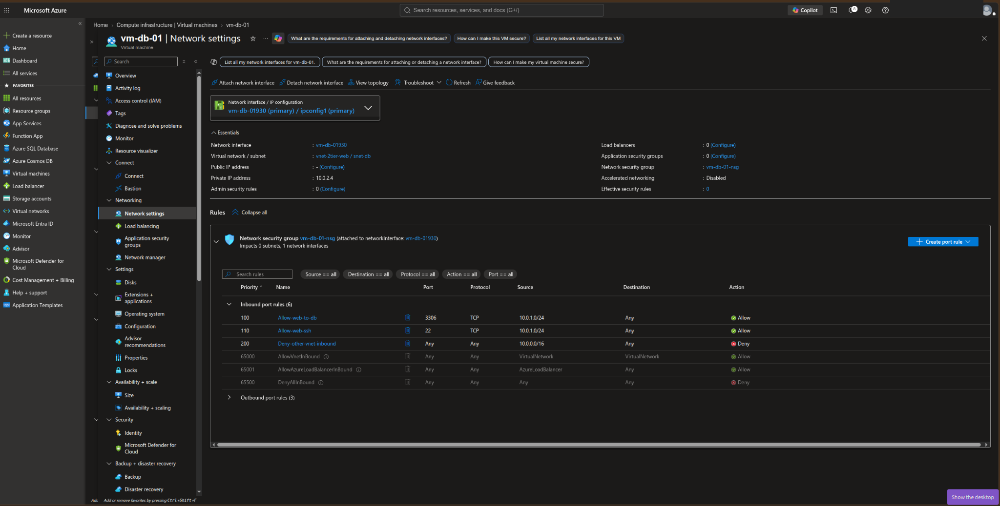
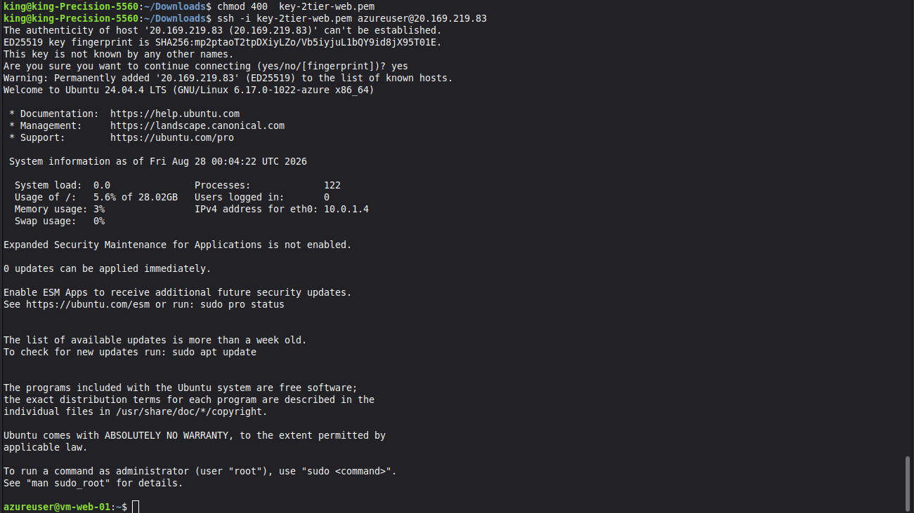
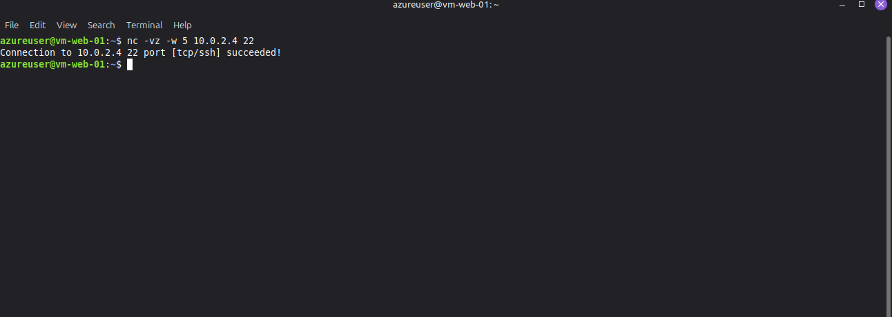
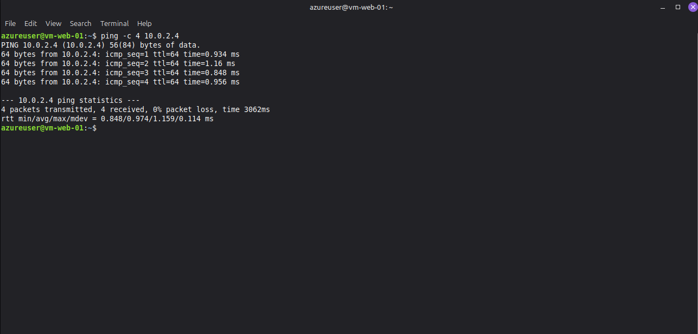
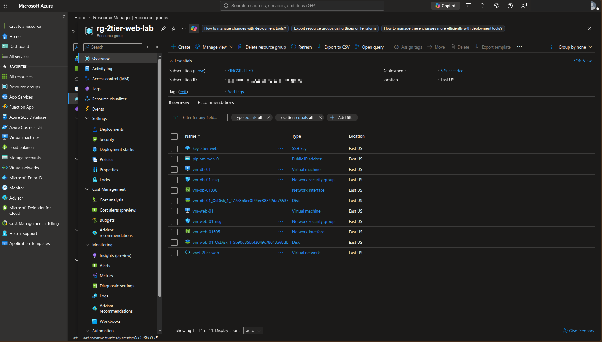
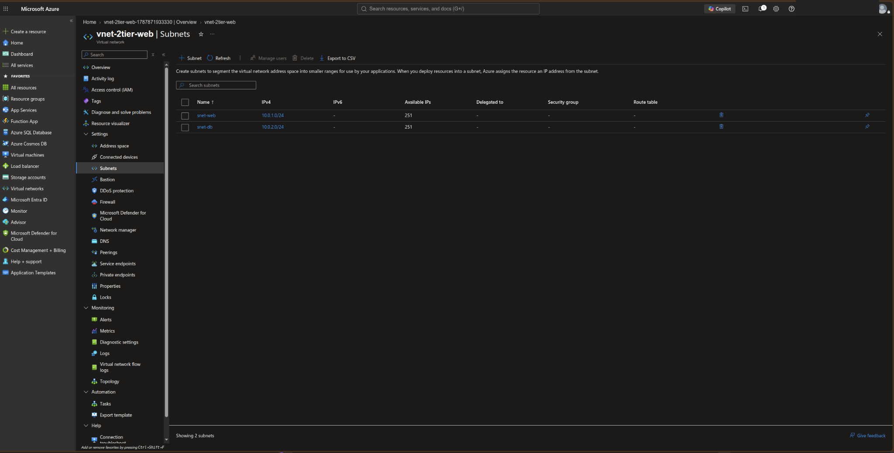
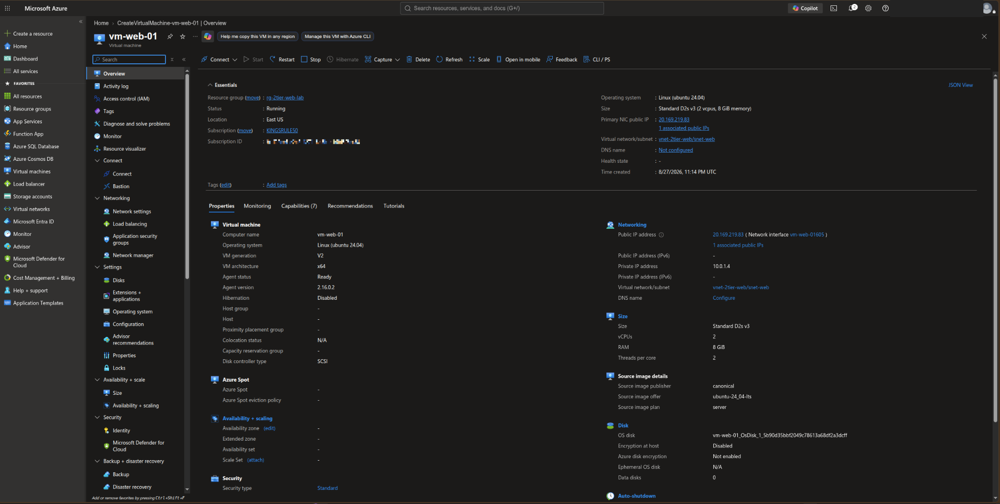
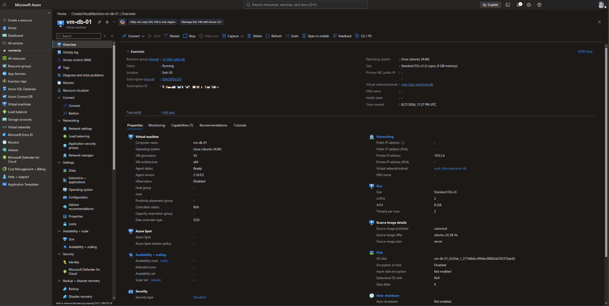

# Azure Secure 2-Tier Web Application Lab

A hands-on Microsoft Azure networking and security lab that demonstrates how to build a segmented two-tier IaaS architecture using a public web tier and a private backend tier.

This project was deployed manually in the Azure portal and focuses on virtual networking, subnet segmentation, Network Security Groups (NSGs), SSH administration, and private VM-to-VM connectivity.

## Architecture



The web VM has a public IP for controlled administrative and web access. The backend VM has **no public IP** and is reachable only through private Azure networking.

## Azure Resources

| Resource | Name / Configuration |
|---|---|
| Resource group | `rg-2tier-web-lab` |
| Region | East US |
| Virtual network | `vnet-2tier-web` |
| VNet address space | `10.0.0.0/16` |
| Web subnet | `snet-web` — `10.0.1.0/24` |
| DB subnet | `snet-db` — `10.0.2.0/24` |
| Web VM | `vm-web-01` — Ubuntu 24.04 LTS |
| Web private IP | `10.0.1.4` |
| Web NSG | `vm-web-01-nsg` |
| DB VM | `vm-db-01` — Ubuntu 24.04 LTS |
| DB private IP | `10.0.2.4` |
| DB NSG | `vm-db-01-nsg` |
| DB public IP | None |

## Security Design

The lab uses network segmentation and least-privilege NSG rules to separate the public-facing web tier from the private backend tier.

### Web Tier NSG

The web VM NSG permits:

- TCP/80 from the Internet for HTTP traffic.
- TCP/22 only from the administrator's approved public IP for SSH management.
- Azure default NSG rules remain in place below the custom rules.



### Backend Tier NSG

The DB VM NSG is more restrictive:

- TCP/3306 is allowed from `10.0.1.0/24` to represent application-to-database traffic.
- TCP/22 is allowed from `10.0.1.0/24` for private administrative connectivity through the web tier.
- Other VNet inbound traffic is explicitly denied by a higher-priority custom deny rule before Azure's default `AllowVNetInBound` rule.
- The DB VM does not have a public IP address.



## Deployment Summary

The project was built manually in the Azure portal using the following high-level sequence:

1. Created the `rg-2tier-web-lab` resource group in East US.
2. Created `vnet-2tier-web` with address space `10.0.0.0/16`.
3. Created two subnets: `snet-web` (`10.0.1.0/24`) and `snet-db` (`10.0.2.0/24`).
4. Deployed `vm-web-01` into the web subnet with a public IP.
5. Configured the web NSG for HTTP and restricted SSH access.
6. Deployed `vm-db-01` into the DB subnet without a public IP.
7. Configured the DB NSG to permit required traffic from the web subnet while denying other VNet inbound traffic.
8. Connected to the web VM using SSH.
9. Validated private connectivity from the web VM to the DB VM.

## Validation

### SSH Access to the Web VM

SSH access to `vm-web-01` was successfully established from the administrator workstation using an SSH key.



### Private TCP Connectivity

From `vm-web-01`, TCP connectivity to the private DB VM on port 22 succeeded:

```bash
nc -vz -w 5 10.0.2.4 22
```

Result:

```text
Connection to 10.0.2.4 22 port [tcp/ssh] succeeded!
```



### Private ICMP Connectivity

Private subnet-to-subnet reachability was also validated with ICMP:

```bash
ping -c 4 10.0.2.4
```

The test returned four replies with **0% packet loss**.



## Screenshots

### Completed Resource Group



### VNet and Subnets



### Web VM



### DB VM



## What This Lab Demonstrates

- Azure Virtual Network design
- CIDR subnetting and address planning
- Public and private VM architecture
- Network Security Group rule design and priority
- Restricting SSH management access
- Backend isolation by removing public exposure
- Private subnet-to-subnet communication
- Linux SSH administration
- TCP and ICMP connectivity testing
- Basic two-tier cloud security architecture

## Scope

This project focuses on **Azure networking and infrastructure security**. The backend VM represents a database tier, but installation and configuration of a MySQL/MariaDB database engine are intentionally outside the scope of this lab.

## Repository Structure

```text
azure-secure-2tier-web-app-lab/
├── README.md
├── docs/
│   └── architecture.md
└── screenshots/
    ├── 01-final-resource-group.png
    ├── 02-vnet-subnets.png
    ├── 03-web-vm-overview.png
    ├── 04-web-nsg-rules.png
    ├── 05-db-vm-overview.png
    ├── 06-db-nsg-rules.png
    ├── 07-ssh-web-vm.png
    ├── 08-private-ssh-connectivity.png
    └── 09-private-ping-connectivity.png
```

## Key Takeaway

A secure two-tier design does not require every server to be internet-facing. By exposing only the web tier and keeping the backend tier on a private subnet, Azure NSGs can enforce controlled communication paths and reduce the attack surface.
