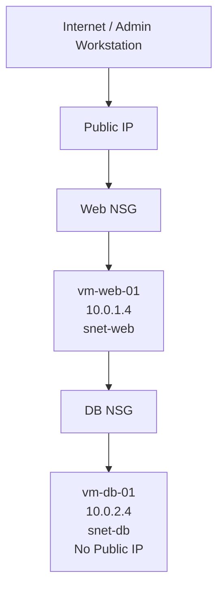

# Architecture and Security Design

## Network Layout

| Component | Network |
|---|---|
| VNet | `vnet-2tier-web` — `10.0.0.0/16` |
| Web subnet | `snet-web` — `10.0.1.0/24` |
| DB subnet | `snet-db` — `10.0.2.0/24` |
| Web VM | `vm-web-01` — `10.0.1.4` |
| DB VM | `vm-db-01` — `10.0.2.4` |

## Web Tier

`vm-web-01` is the public-facing system. Its NSG allows HTTP on TCP/80 and restricts SSH on TCP/22 to an approved administrator source IP.

## Backend Tier

`vm-db-01` is deployed without a public IP. Its NSG permits the web subnet (`10.0.1.0/24`) to reach TCP/3306 and TCP/22, then applies an explicit deny for other traffic from the VNet address space before Azure's default VNet allow rule.

## Security Principles Demonstrated

- **Network segmentation:** separate web and backend subnets.
- **Reduced attack surface:** backend VM has no direct Internet exposure.
- **Least privilege:** only required ports and sources are permitted.
- **Rule priority awareness:** custom NSG rules are evaluated before Azure defaults.
- **Private communication:** traffic between tiers remains on Azure private networking.
